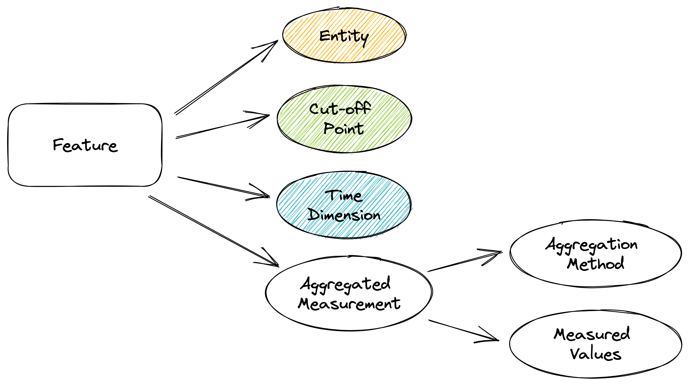

# Feature Definition

A feature is a measurable property of the object you're trying to analyze, and it consists of four main components below to be fully defined.

1. Entity: the object that has the Property that we consider, such as the Entity that could be `user` and the desirable Property to be measured is `balance` (amount of money in their wallet).
2. Cut-off Point (CP): where do we measure and compute the Property in the timeline of that object, such as `at 2023-01-01 00:00:00 UTC`.
3. Time Dimension: the dimension in the timeline of that object, which has the start and end points and directions to travel in time. For example, `last 7 days = (CP - 7 days -> CP)`, `ytd = (01/01/yearOfCP -> CP)`.
4. Aggregated Measurement: the computed result from the measured values of that Property.
   1. Measured Values: the measured value of each instance of that Property; therefore, the measured value must come with a timestamp where the Measurement is taken.
   2. Aggregation Method: the computation method to be applied to valid measured values based on the CP and Time Dimension combination.

<figure><figcaption>
Atomic View of a Feature
</figcaption></figure>

A real-world example.

<figure><figcaption>
Feature Example
</figcaption></figure>

What happens with Hierarchical Property?\
\
Data, in reality, is much more complex than the example above; properties of an object could have hierarchical characteristics.

In the example below, `amount` is a Property of user financial transaction; however, a hierarchy is embedded in how we define this Property. It could be `(bank_name -> card_type -> category)` any combination of these three.

In the abstraction level of Feature, we organize data in a flattened manner, including the four components mentioned above. Therefore, the decision should be taken early in defining the Feature to choose which hierarchy level and in which order we should add to the existing Property to generate a new one.

For example, we could decide to create new derived Properties, such as `amount_credit` and `amount_debit`. We can think of these derived Properties as Features because to calculate them, we must also define Aggregation Method and Time Dimension.&#x20;

| bank | card\_type | category | amount | timestamp           |
| ---- | ---------- | -------- | ------ | ------------------- |
| vcb  | credit     | shopping | -25000 | 2023-01-01 17:00:00 |
| vcb  | debit      | income   | 100000 | 2023-01-05 09:00:00 |
| hsbc | credit     | shopping | -8000  | 2023-02-04 12:00:00 |

The new Properties will be like this.

| amount\_credit\_eod | amount\_debit\_eod | timestamp           |
| ------------------- | ------------------ | ------------------- |
| 0                   | -25000             | 2023-01-01 23:59:59 |
| 0                   | 100000             | 2023-01-05 23:59:59 |
| -8000               | 0                  | 2023-02-04 23:59:59 |
